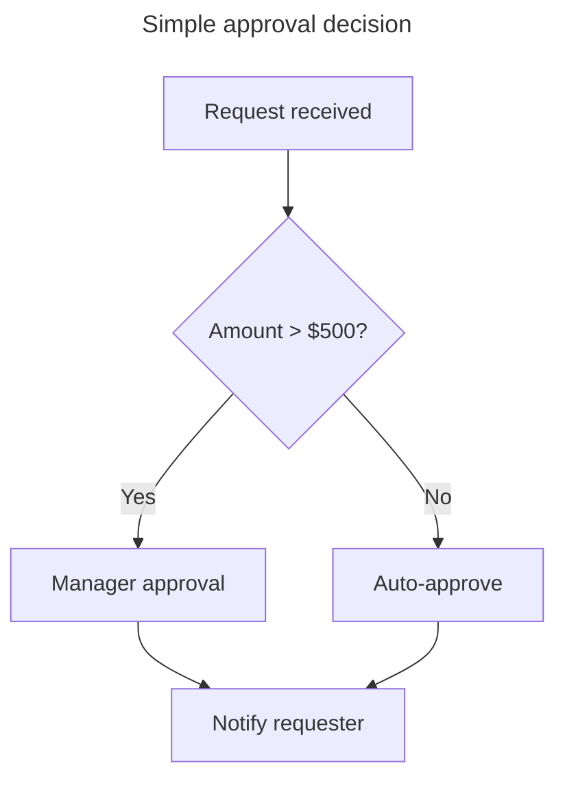

# Decision Tree

```mermaid
---
title: Simple approval decision
---
flowchart TD
    A[Request received] --> B{Amount > $500?}
    B -->|Yes| C[Manager approval]
    B -->|No| D[Auto-approve]
    C --> E[Notify requester]
    D --> E
```
