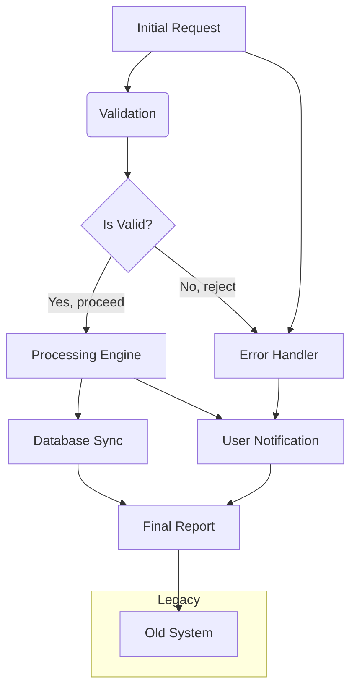

# Cluttered Project Flow

This is a raw, cluttered diagram that needs a professional executive upgrade.

```mermaid
graph TD
    Node1[Initial Request] --> Node2(Validation)
    Node2 --> Node3{Is Valid?}
    Node3 -- "Yes, proceed" --> Node4[Processing Engine]
    Node3 -- "No, reject" --> Node5[Error Handler]
    Node4 --> Node6[Database Sync]
    Node5 --> Node7[User Notification]
    Node6 --> Node8[Final Report]
    Node7 --> Node8
    Node1 --> Node5
    Node4 --> Node7
    subgraph Legacy
    Node9[Old System]
    end
    Node8 --> Node9
```
