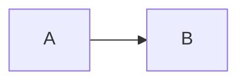
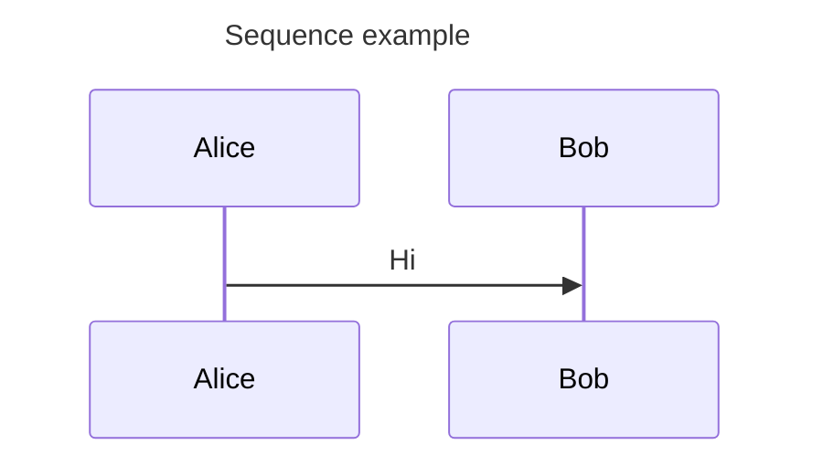
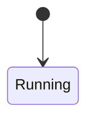

# Doc with multiple diagrams

First diagram:

```mermaid
flowchart LR
    A --> B
```

Prose between.

```mermaid
---
title: Sequence example
---
sequenceDiagram
    Alice->>Bob: Hi
```

And a third:

```mermaid
stateDiagram-v2
    [*] --> Running
```
